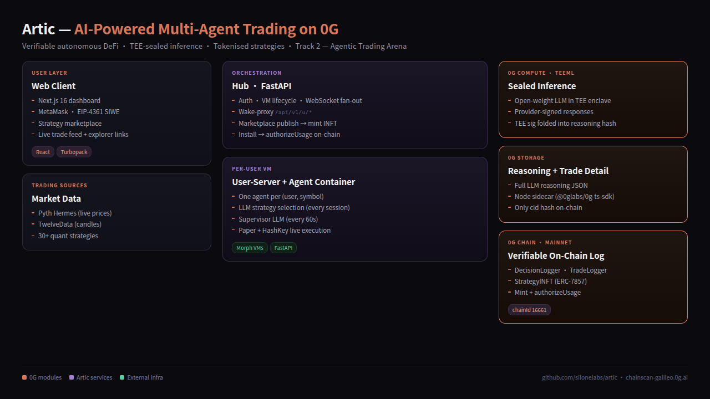

# Artic — Verifiable AI Trading on 0G

> Autonomous AI trading agents where every decision is cryptographically verifiable, every strategy is privately tradable, and every reasoning trace is permanently auditable.



---

## 0G Hackathon Submission

| Field | Value |
|---|---|
| Project | **Artic** |
| Track | **Track 2 — Agentic Trading Arena (Verifiable Finance)** |
| Chain | **0G Mainnet** — chainId `16661` |
| RPC | `https://evmrpc.0g.ai` |
| Explorer | `https://chainscan.0g.ai` |
| 0G modules used | 0G Chain · 0G Storage · 0G Compute (TeeML) · INFT (ERC-7857) Agent ID · TEE Privacy |

### Deployed Contracts (0G Mainnet)

| Contract | Address | Purpose |
|---|---|---|
| **DecisionLogger** | [`0x70a15Db526104abC2f021b7c690cd89a07EDE49C`](https://chainscan.0g.ai/address/0x70a15Db526104abC2f021b7c690cd89a07EDE49C) | Every supervisor AI decision (HOLD / OPEN / CLOSE / ADJUST) with reasoning hash + TEE attestation hash |
| **TradeLogger** | [`0xeeb56334152D6bDB62aacF56f8DbCceA5210b78D`](https://chainscan.0g.ai/address/0xeeb56334152D6bDB62aacF56f8DbCceA5210b78D) | Every trade open/close with side, entry, exit, PnL bps, detail hash |
| **StrategyINFT (ERC-7857)** | [`0x2A9caFEDFc91d55E00B6d1514E39BeB940832b5D`](https://chainscan.0g.ai/address/0x2A9caFEDFc91d55E00B6d1514E39BeB940832b5D) | Tradable Agent ID — strategy NFT with encrypted config metadata |

**Verified on-chain activity** (smoke test from platform signer):

- DecisionLogged: [`0x2bcbb3a3…a20e`](https://chainscan.0g.ai/tx/0x2bcbb3a3a218f7d96ccb71e596daae3d770c8f33d6f2cbfb3b95e5d0bd44a20e)
- TradeLogged: [`0xe577e9cc…68e0`](https://chainscan.0g.ai/tx/0xe577e9cc5b54ccb1a26a995ced1313d3999fd5f2a8ff506bca6728c838fc68e0)

---

## 1. Project Overview

**The problem.** Autonomous AI trading today is a black box. There is no way for a user to verify what an AI agent decided, why it decided it, or whether execution matched intent. Proprietary strategies leak through public mempools and get front-run. Strategy operators cannot prove they are running the strategy they advertise. Buyers of strategies have to trust that the seller will not steal their alpha after they pay.

**Artic.** A multi-agent trading platform where:

1. An LLM running **inside a Trusted Execution Environment** (0G Compute, TeeML mode) selects from 30+ quantitative strategies and supervises open positions every 60 seconds.
2. **Every supervisor decision and every trade** is logged immutably to 0G Chain (`DecisionLogger`, `TradeLogger`). Block confirmations make execution publicly auditable.
3. The **full LLM reasoning text** is uploaded to 0G Storage; only the content hash lands on-chain. Auditors can fetch the why behind any decision without bloating chain state.
4. **Strategies are tokenised as ERC-7857 INFTs** (Agent ID standard). Publishing a strategy mints an INFT whose `metadataHash` references the encrypted config. Buyers receive `authorizeUsage` rights — they can run the strategy but never see the code. Transfers trigger oracle-mediated metadata re-encryption so the previous owner cannot keep using a copy.
5. **Authentication is EIP-4361 SIWE** on 0G; the per-symbol agent runtime is isolated inside Morph VMs.

Net result: an LLM-run multi-agent trading platform where every action is publicly verifiable, every strategy is privately tradable, every reasoning trace is permanently auditable, and proprietary alpha is hardware-sealed.

---

## 2. System Architecture

```
┌──────────────┐    EIP-4361 SIWE (0G)     ┌──────────────┐
│  Web Client  │ ────────────────────────▶ │     Hub      │
│  (Next.js)   │ ◀── /api/v1/u/* proxy ─── │  (FastAPI)   │
└──────────────┘                           └──────┬───────┘
                                                  │ wake / spawn
                                                  ▼
                                          ┌──────────────┐
                                          │ User-Server  │ ── spawns ──┐
                                          │   (per VM)   │             │
                                          └──────────────┘             ▼
                                                                 ┌──────────────┐
                                                                 │   Agent      │
                                                                 │ (one symbol) │
                                                                 └──────┬───────┘
              ┌─────────────────────────────────┬────────────────┬─────┴────────────┐
              ▼                                 ▼                ▼                  ▼
        ┌───────────┐                  ┌─────────────────┐  ┌───────────┐    ┌─────────────┐
        │ 0G Chain  │                  │   0G Compute    │  │ 0G Storage│    │  Exchange   │
        │ Loggers + │                  │     TeeML       │  │ reasoning │    │  (paper /   │
        │   INFT    │                  │  sealed infer   │  │   JSON    │    │  HashKey)   │
        └───────────┘                  └─────────────────┘  └───────────┘    └─────────────┘
```

**Per-tick flow inside an agent:**

1. Fetch live price (Pyth Hermes) + cached candles (TwelveData).
2. Strategy `compute()` produces signal (BUY / SELL / HOLD).
3. Every ~60s with open position: supervisor LLM call → routed to **0G Compute TeeML** → returns KEEP / CLOSE / ADJUST + reasoning text + provider's TEE signature.
4. Reasoning JSON uploaded to **0G Storage** → returns root hash (cid).
5. **`DecisionLogger.logDecision(...)`** emits on-chain event with `reasoningHash = keccak(cid + tee_sig)`.
6. On trade open/close: **`TradeLogger.logTrade(...)`** with detail hash + 0G Storage upload.
7. Hub persists cid alongside trade row; dashboard fetches reasoning on demand via `GET /api/v1/u/hub/trades/{id}/reasoning`.

**Per marketplace publish:**

1. Author writes a strategy in the web client, runs backtest.
2. Hub validates AST, computes `strategyHash`.
3. Hub calls **`StrategyINFT.mint(author, metadataHash, sealedConfigHash)`** → INFT minted on 0G.
4. INFT row recorded in `marketplace_strategies` table with `inft_token_id` + `inft_mint_tx`.

**Per marketplace install (purchase):**

1. Buyer clicks Install in dashboard.
2. Hub copies the strategy to the buyer's library.
3. Hub calls **`StrategyINFT.authorizeUsage(tokenId, buyer)`** on 0G — buyer now has execution rights without seeing the encrypted config.
4. Buyer activates with their desired position size; sealed-executor runs the strategy.

---

## 3. 0G Modules Used

| Module | Where in Artic | How it supports the product |
|---|---|---|
| **0G Chain** | `hub/onchain/inft_client.py`, `app/onchain_logger.py`, `app/onchain_trade_logger.py`, `contracts/*.sol` | Three custom EVM contracts emit indexed events for every AI decision, every trade, and every INFT mint/authorize. Chain becomes the canonical audit log. |
| **0G Compute (TeeML)** | `app/llm/og_compute.py`, integrated as `LLM_PROVIDER=0g_compute` in `app/llm/llm_planner.py` | LLM strategy selection + 60-second supervisor calls run inside a hardware TEE on a 0G Compute provider. Open-weight model (Llama 3.3 / DeepSeek R1) signs each response; signature hash is folded into the on-chain `reasoningHash` for attestation linkage. Result: front-running becomes impossible because the strategy logic is sealed in the enclave. |
| **0G Storage** | `app/storage/og_storage.py` + Node sidecar `app/storage/sidecar/index.js` (uses `@0glabs/0g-ts-sdk`) | Full LLM reasoning JSON + trade-detail JSON uploaded to 0G Storage. On-chain only holds the root hash. Dashboard fetches the reasoning text on demand via `/api/v1/u/hub/trades/{id}/reasoning`. Makes the audit trail complete *and* cheap. |
| **INFT (ERC-7857) — Agent ID** | `contracts/StrategyINFT.sol`, `hub/onchain/inft_client.py` | Each published strategy = one INFT. Encrypted metadata pointer + sealed config hash. `authorizeUsage()` grants execution rights without exposing config. `transferFrom` triggers `MetadataReencrypted` event for the oracle to rotate keys. Realises a true tradable-AI-agent marketplace. |
| **TEE / Privacy & Security** | TeeML wrapping of all LLM calls + sealed-executor pattern in INFT | Hardware-enforced privacy for proprietary strategy logic. Strategy code never leaves the enclave; results are signed; signatures are attested on-chain. |

*(0G Persistent Memory is listed as "coming soon" in the 0G docs and is not yet integrated.)*

---

## 4. Repo Layout

```
app/                        # Per-symbol trading engine (FastAPI)
├── engine.py               # Trading loop
├── llm/
│   ├── llm_planner.py      # Strategy selection + supervisor
│   └── og_compute.py       # 0G Compute TeeML client
├── storage/
│   ├── og_storage.py       # 0G Storage client (subprocess to sidecar)
│   └── sidecar/            # Node sidecar (@0glabs/0g-ts-sdk)
├── strategies/             # 30+ quant strategies
├── onchain_logger.py       # DecisionLogger client
└── onchain_trade_logger.py # TradeLogger client

hub/                        # Central orchestrator (FastAPI)
├── auth/verifiers/
│   └── evm_siwe.py         # EIP-4361 verifier (0G mainnet)
└── onchain/
    ├── inft_client.py      # StrategyINFT mint + authorizeUsage
    └── marketplace_client.py

user-server/                # Per-VM agent runtime + DB push endpoints

contracts/                  # Solidity sources + deploy scripts
├── DecisionLogger.sol
├── TradeLogger.sol
├── StrategyINFT.sol        # ERC-7857
├── deploy.py
├── deploy_trade_logger.py
└── deploy_inft.py

clients/web/                # Next.js dashboard + marketplace
```

---

## 5. Local Deployment (Judges)

### Prerequisites

- Python 3.11+
- Node 20+, npm or Bun
- PostgreSQL 15 (local or managed — Neon works)
- 0G Mainnet wallet with ≥ 5 0G (for gas + Compute sub-account funding)
- `git`, `make` (optional)

### Steps

```bash
# 1. Clone
git clone https://github.com/<your-org>/Artic.git && cd Artic

# 2. Python env
python3 -m venv venv
source venv/bin/activate
python -m pip install -r requirements.txt

# 3. Environment files
cp .env.dev.example .env
# Edit .env — set DATABASE_URL, JWT_SECRET, INTERNAL_SECRET

# 4. Local platform secrets (gitignored)
cat > .env.local <<'EOF'
ZERO_G_RPC_URL=https://evmrpc.0g.ai
ZERO_G_CHAIN_ID=16661
ZERO_G_EXPLORER_BASE=https://chainscan.0g.ai
ZERO_G_STORAGE_INDEXER_URL=https://indexer-storage-turbo.0g.ai
CHAIN_RPC_URL=https://evmrpc.0g.ai
CHAIN_PRIVATE_KEY=0x<your-mainnet-key>
CHAIN_ADDRESS=0x<your-mainnet-addr>
DECISION_LOGGER_ADDRESS=0x70a15Db526104abC2f021b7c690cd89a07EDE49C
TRADE_LOGGER_ADDRESS=0xeeb56334152D6bDB62aacF56f8DbCceA5210b78D
INFT_CONTRACT_ADDRESS=0x2A9caFEDFc91d55E00B6d1514E39BeB940832b5D
# Optional for TeeML inference:
LLM_PROVIDER=0g_compute
ZERO_G_COMPUTE_PROVIDER=0x<provider-addr>
ZERO_G_COMPUTE_SECRET=app-sk-<secret>
EOF

# 5. 0G Storage sidecar dependencies
cd app/storage/sidecar && npm install && cd ../../..

# 6. Database migrations
set -a; . ./.env; . ./.env.local; set +a
python -m alembic -c hub/alembic.ini upgrade head

# 7. Launch services (separate terminals)

# Terminal A — hub on :9000
set -a; . ./.env; . ./.env.local; set +a
python -m uvicorn hub.server:app --host 127.0.0.1 --port 9000

# Terminal B — user-server on :8001
cd user-server
set -a; . ../.env; . ../.env.local; set +a
python -m uvicorn user_server.server:app --host 127.0.0.1 --port 8001
cd ..

# Terminal C — web client on :3000
cd clients/web
echo 'NEXT_PUBLIC_HUB_URL=http://localhost:9000' > .env.local
bun install   # or npm install
bun dev       # or npm run dev
```

### Verify

```bash
# Hub up
curl http://127.0.0.1:9000/health
# → {"ok":true,"service":"hub"}

# 0G mainnet reachable
python -c "from web3 import Web3; w3=Web3(Web3.HTTPProvider('https://evmrpc.0g.ai')); print('chainId:',w3.eth.chain_id,'block:',w3.eth.block_number)"
# → chainId: 16661, block: <recent>

# Open dashboard
open http://localhost:3000/connect
# → connect MetaMask on 0G Mainnet → sign nonce → enter app
```

### End-to-End Demo Flow

1. Open `http://localhost:3000/connect`.
2. Click **Connect EVM wallet** — MetaMask pops; pick the 0G Mainnet account.
3. Click **Sign in to hub (SIWE)** — sign the nonce message; JWT returned.
4. Go to `/app` → **Create Agent** for `BTC/USDT`.
5. Watch supervisor LLM tick every 60s; first decision posts on-chain.
6. Click the `tx ↗` link in the trade row → opens `https://chainscan.0g.ai/tx/<hash>`.
7. Click the `reasoning ↗` link → fetches full reasoning JSON from 0G Storage via hub proxy.
8. Publish a strategy from `/app/strategies/new` → INFT minted, view it at the StrategyINFT contract address.

---

## 6. Reviewer Notes

- **Faucet**: 0G Mainnet faucet — DM the 0G team. The hackathon platform signer (`0xbEff5…c0f5`) is funded with ≈9.9 0G for the demo flow. Sample on-chain activity already exists for reviewers who want to inspect the contracts before running locally (see *Verified on-chain activity* above).
- **TeeML readiness**: `app/llm/og_compute.py` is wired but expects a funded 0G Compute provider sub-account (≥1 0G). When absent, the LLM falls back to whichever `LLM_PROVIDER` is set (OpenAI / Anthropic / DeepSeek / Gemini all supported). All other 0G modules work without this dependency.
- **DB schema**: Migrations `0001` → `0008` apply cleanly. Compatible with Neon Postgres (uses `ssl=require` → translated to `sslmode=require` for psycopg2).
- **Auth chain key**: web client sends `chain=0g-mainnet`; verifier is `verify_evm_siwe` in `hub/auth/verifiers/evm_siwe.py`. Cosmos ADR-36 path is removed; only 0G EVM SIWE is supported.
- **Storage sidecar**: `app/storage/sidecar/` is a tiny Node CLI invoked via `subprocess` by `app/storage/og_storage.py`. Logs failure as warning and continues — never blocks the trading loop.
- **INFT mint cost** on mainnet was ≈0.0013 0G per mint; `mint()` is `onlyOwner` (hub platform signer); change to open-mint by relaxing the modifier in `contracts/StrategyINFT.sol` if needed.

---

## 7. Demo Video

[Insert YouTube/Loom link — 3 minutes max]

Shows:
- Connect 0G Mainnet wallet via SIWE
- Start a paper-trade agent
- LLM strategy selection routed through 0G Compute
- DecisionLogged + TradeLogged events appearing on `chainscan.0g.ai` in real time
- Reasoning text fetched from 0G Storage
- Strategy publish → StrategyINFT mint on `chainscan.0g.ai`

---

## License

See [LICENSE](LICENSE).
